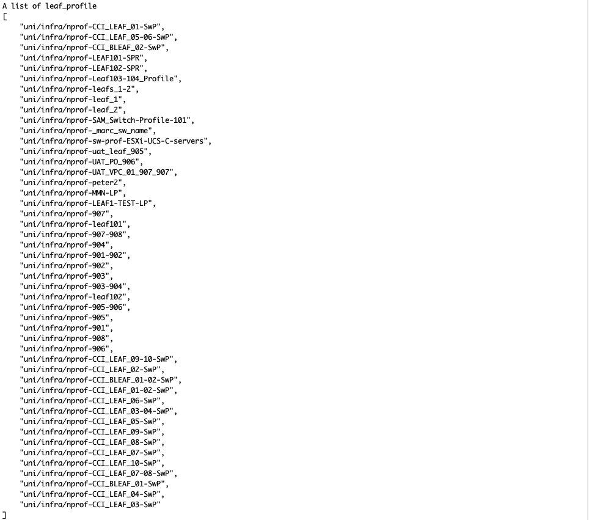

# aci_utilities
> A collection of scripts I use with Cisco ACI.

## Table of contents
* [General info](#general-info)
* [Screenshots](#screenshots)
* [Setup](#setup)
* [Features](#features)
* [Status](#status)
* [Inspiration](#inspiration)
* [Contact](#contact)

## General info
My day-to-day work involves Cisco ACI a lot so I created a collection of python functions to help me make my job easier.

## Screenshots

## Setup
* This project was tested on python 3.7.6.
* Clone the project
* Create virtual environment: `python -m venv env`
* Activate the virtual environment: `source env/bin/activate`
* Add library requirement: `pip install -r requirements.txt`
* Change the APIC's IP and credentials in settings_sample.json and rename it to settings.json
* Modify the object name inside main.py to suit your need and run: `pyhon main.py`

## Code Examples

## Features
List of features ready and TODOs for future development
* List objects' DN under an object class
* Delete an object in an object class
To-do list:

## Status
Project is: _in progress_

## Inspiration
Working with ACI requires cleaning up a lot of things and it's tedious to do it manually on the GUI. It's simple to clean up the objects I have created but it's quite challenging to clean up someone else's work. Example of this is in a shared lab environment where not many people clean up their objects properly. I decided to write a simple function to return a list of all objects under a class so I can clean up everything. 
Thanks README.md template from https://github.com/ritaly/README-cheatsheet

## Contact
Created by [@disruptednetwork](https://github.com/disruptednetwork) - feel free to contact me!
